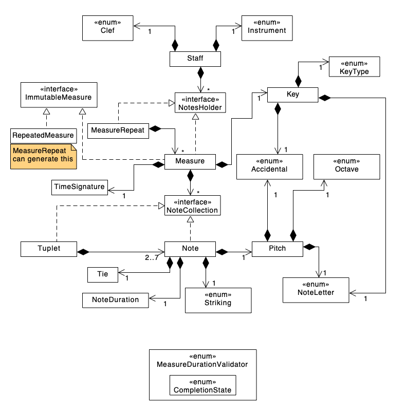

# Music Notation Core
==============


[](https://github.com/apple/swift-package-manager)


This is a **work in progress**, Cross-Platform Music Notation API written in Swift. It is written so
that it can be used in most any operating system, such as iOS, macOS, Android, Windows, and Linux
assuming that Swift is ported to these platforms. This library is being created with the goal of
having 0 dependencies; not even Foundation.

If you are looking for the ability to display the music in an application, please see
[MusicNotationKit](https://github.com/drumnkyle/music-notation-kit), which depends on this core
library.

Please consult this [Swift style guide](https://github.com/music-notation-swift/swift-style-guide)
for coding style guidelines used in this repo and be sure to adhere to them.

There is a Slack channel you can join if you want to see more into the development process at
[Music Notation Swift Slack](https://join.slack.com/t/musicnotationswift/shared_invite/enQtOTE1NzQyMzI5MTA2LWZlN2MyNmI5MjA2Njc4MGQ5N2IxNzYzY2QxMmYwNmFlNDNmNjUwNjBlMGY1MWIzNDkxMzY2MzAwNjc4NTJkNjU).

---

This library is meant to provide an easy-to-use API for creating tablature or staff music to be
displayed or played in an application. The library is not meant to deal with any UI or Audio, so
that it may be used with any other UI or Audio frameworks.

There is also a plan to create an easy to use input file format to create the music instead of
having to create the objects in code as it stands right now. Hopefully a file format can be
developed that will be able to make it so simple that a musician who is not necessarily tech savy,
would be able to create sheet music or tablature. There are also some open file formats that may be
looked into, such as MusicXML (http://www.musicxml.com).

## Contents

- [Code Requirements](#code-requirements)
- [Installation](#installation)
- [Class Diagram](#class-diagram)
- [Duration Calculator](#duration-calculator)
- [Different Notes at Same Time](#different-notes-at-same-ime)
- [Indexing Methodology](#indexing-methodology)
- [Tuplet Design](#tuplet-design)
- [License](#license)
- [Contributing](#contributing)

## Code Requirements

- iOS 18 / macOS 15
- Xcode 16
- Swift 6

## Installation

### Swift Package Manager

```swift
dependencies: [
	.package(url: "git@github.com:music-notation-swift/music-notation-core.git"),
]
```

Or simply include it from within Xcode in the Swift Packages section of your project.

## Class Diagram



## Duration Calculator

**Authors**: [Kyle Sherman](http://github.com/drumnkyle), [Miguel Osorio](http://github.com/modix)

The number of beats in a measure depend on the time signature. The top number 
of the time signature determines the number of beats per measure, while the 
bottom one determines the length of one beat. 

For example:

`4/4`: 4 beats of 1/4 notes.
`6/8`: 6 beats of 1/8 notes.

### Note Measurement

#### Convert Note Duration Into Ticks Per Quarter Note (TPQN)

Calculate measure budget based on time signature. Ideally, it is not ideal to
work with fractions, so it would be better to express lengths w.r.t the shortest
note.

[](https://en.wikipedia.org/wiki/Two_hundred_fifty-sixth_note)

The shortest recorded note is 1/256, which means that we would have to
use at least 1/512 to account for a 1/256 dot length, or 1/1024 to account for a
double dot. 

Lets say we go with 1024: 


|Note Duration | Note Weight |
|--------------|-------------|
|1             |         1024|
|1/2           |          512|
|1/4           |          256|
|1/8           |          128|
|1/16          |           64|
|1/32          |           32|
|1/64          |           16|
|1/128         |            8|
|1/256         |            4|
|1/512         |            2|
|1/1024        |            1|

`1/1024 = 1 for a note: (1/256)+dot+dot`

Another solution is to make the calculations w.r.t to the quarter note (1/4).
This is nice because it would make us more compatible with MIDI (see 
https://en.wikipedia.org/wiki/Pulses_per_quarter_note). With this in mind, 
we can probably use Ticks Per Quarter Note (TPQN).

Music XML supports 1/1024 notes:

[](http://usermanuals.musicxml.com/MusicXML/Content/ST-MusicXML-note-type-value.htm)

#### Implementation

- Make TPQN configurable (e.g 1024, TODO: look into MIDI time duration). This
  parameter is not necessarily exposed in the public API.
- Calculate budget in terms of TPQN. For example: `4/4 = 4 * TPQN, 6/8 = 6 * (TPQN / 2)`.
  In the case of `6/8` TPQN id divided by 2 because an eighth note is half of a quarter.

### Measure Calculations

- Measure occupancy value (measure usage): used space / measure budget.
- Proposed API: Suggest available note durations given used space. 
- Proposed API: Validate measure.
- ~~Proposed setting to enable automatic validation. This implementation would
  leverage incremental changes in the measure occupancy values.~~
- Insert note (Methods implemented in Measure class).
- Delete note (Methods implemented in Measure class).
- Replace note. This can be a combination of delete followed by insert?

### New API

New enum: `MeasureDurationValidator` with all static methods.

#### Latest Draft

```swift
public enum MeasureDurationValidator {
    public enum CompletionState {
        case notFull(availableNotes: [NoteDuration : Int])
        case full
        case overfilled(overflowingNotes: Range<Int>)
    }
    public static func completionState(of measure: ImmutableMeasure) -> CompletionState
    public static func number(of noteDuration: NoteDuration, fittingIn: ImmutableMeasure) -> Int
```

#### First Draft

```swift
public enum MeasureDurationValidator {
    public enum CompletionState {
        case notFull
        case full
        case overfilled
    }
    public static func completionState(of measure: Measure) -> CompletionState
    public static func number(of noteDuration: NoteDuration, fittingIn: Measure) -> Int
    public static func overflowingNotes(for measure: Measure) -> Range<Int>?
    public static func availableNotes(for measure: Measure) -> [NoteDuration : Int]
}
```

Changes to `Staff`
- Create method to split a `Measure` that is overfilled into 2 measures. This utilizes the return
value from `MeasureDurationValidator.overflowingNotes(for:)`.

Changes to `Measure`:
- Make a way to modify `Tuplet`s and replace `Tuplet`s.
- There may be a way to reuse functionality from `Staff.insertMeasure`, so think about it...

Opens:
- How to deal with irrational meter (i.e. 4/3 time signature)
- ~~Good to have the ability to tell what can be used to fill the measure.~~
- ~~Let the API caller know that the measure is incomplete.~~
- ~~Add the ability to split the measure.~~ See changes for `Staff`
- ~~What happens when the user changes the time signature. Do we allow this?~~ Yes. We just call the methods.

## Different Notes at Same Time

Authors: [Kyle Sherman](http://github.com/drumnkyle), [Miguel Osorio](http://github.com/modix)

### Introduction

In music, you can have a note with 2 different pitches played at the same time. You see this with
one stem and 2 note heads coming off of it on different staff lines/spaces. This has already been
accomplished by making every `Note` have an array of `SpelledPitch`es. However, at the same time,
you may also have a note of a different duration be played at the same time. Throughout this
document I will refer to this as a second *set* of notes in the measure.

#### Terminology

- **Set** of notes is one set of notes that need to equal a full measure (like the bass drum part of
a drumset score).
- **Time slice** is the vertical slice of a measure where a note would be laid out. If 2 notes occur
at the same exact time, they would be rendered in the same *time slice*.

#### Example

This happens quite often in drumset music. With a standard rock beat in 4/4, you have the hi-hat
playing eighth notes throughout the whole measure. The snare drum plays eighth notes on beats 2 and
4, which can be represented as 2 pitches on the notes that have the snare drum and hi-hat at once.
Then, you have the bass drum on beats 1 and 3 as quarter notes with quarter note rests in between.

### All Cases

This second set of notes in the measure can occur:
	- at the same time as another note in a different set
	- in between two notes in a different set

### Requirements

	- Each set of notes must constitute a full measure (i.e. 4 beats in 4/4; no more, no less)
	- You cannot have the same pitch represented by 2 sets at the same exact time. **Open**: Can you?
	    - **Open**: How do we enforce this? Seems like it needs to be some type of measure validation.
	- Need to support the ability for a rendering library to be able to draw the measure easily
    - time slice by time slice
	- API should be as simple as possible to perform measure mutation functionality

### Proposed Solution
#### Two Dimensional Array

We take the array of `[NoteCollection]` that we have now and make it two dimensional:
`[[NoteCollection]]`. Each set of notes will be represented as an element in the outermost array.

##### Reasoning
	- We can perform measure duration validation on each element of the outermost array completely separately.
	- Rendering index into each sub-array at the same time so that it can easily know if the notes line up with each other in the time slices.
	- API can change to simply have a set index that can default to 0.

### Alternatives Considered
#### Graph

We did not explore too deply into this, because it seemed that this would add much complexity. This
would especially make it difficult to index into the measure in order to perform any of the mutation
functionality. Therefore, we tabled this.

#### Single-Dimensional of structs Representing multiple sets

We thought we might be able to have a single-dimensional array of some protocol type that
represented a vertical time slice. This way you would have an simple, single dimensional array. And
you would have multiple notes represented in some sort of protocol that represented a single slice
of time.

##### Problems

The main issue is that this would make measure duration validation very difficult. Insertion would
also become very difficult as you would have to figure out if you needed a new time slice in between
two existing ones or if this lines up with a time slice that is already there.

## Indexing Methodology

**Author**: [Kyle Sherman](http://github.com/drumnkyle)

### Audience

This design document goes over an implementation detail that is only pertinent to maintainers and
developers of this library and not to users of the API.

### Introduction

Throughout the implementation of multiple structs in this library, a technique is used to allow for
indexing of elements within a container in two different ways at the same time. There is indexing
that accesses the structs that store the information and then there is indexing used to access the
data as a user would see it (flattened).

#### Example

`Staff` holds an array of `NotesHolder`s. `NotesHolder` is a protocol that both `Measure` and
`MeasureRepeat` implement. Therefore, the staff holds an array where each element is either a
`Measure` or a structure that stores the data for one or more `Measure`s that are repeated
(`MeasureRepeat`).

For a method like `Staff.insertMeasure(at:beforeRepeat)`, the index given to the `at` parameter
would take into account the expanded `MeasureRepeat`, including its repeated measures. Therefore, in
order to do this indexing, we need to be able to translate from that index to the index in the array
of `NotesHolder`s that the `Staff` stores and into the `MeasureRepeat` if that is what exists at the
specified index.

### Implementation
#### Overview

We have a method called `recompute<Name>Indexes` that gets called in the `didSet` of the array that
we need to compute this secondary set of indexes for. For `Staff` the method is called
`recomputeMeasureIndexes`. In this method, we loop through the array and get the index of any nested
structures and expand those indexes. The resulting data structure is an array of tuples. The tuple
has 2 elements: primary index and secondary index. The secondary index is optional, because it is
only used if there is a nested data structure at that index.
    
#### Concrete Example

`Staff.recomputeMeasureIndexes()` will set the `measureIndexes` array. This array will store tuples
of `(notesHolderIndex: Int, repeatMeasureIndex: Int?)`.

#### Detail

`recompute<Name>Indexes` will loop through the array and add a tuple entry to the indexes array. If
it encounters a nested structure, it will perform a nested loop and add a tuple entry for every
element in that nested structure as well.

#### Efficiency

Therefore, the worst case efficiency of this algorithm is `O(n*m)` where `n` is the number of
elements in the main array and `m` is the number of elements in the nested structure. Of course, a
piece of music is not going to have all nested structures.

To limit the hit to performance, this method is performed only when the array is modified. The idea
is that the array will be modified less times than the non-mutating methods will be called. However,
this has not been explored or tested fully. The performance has also not been specifically measured.

**Open**: If anyone can think of a more efficient way, please let us know.

**Open**: This seems like it could be useful to make this generic instead of writing very similar
code over and over. However, I cannot presently think of a convenient way to do that, though I
haven't thought too hard about it yet. 

### Usages
- Used in `Staff` for the array of `NotesHolder`s.
- Used in `Measure` for the array of `NoteCollection`s.
- Used in `Tuplet` for the array of `NoteCollection`s.

## Tuplet Design

**Author**: [Kyle Sherman](http://github.com/drumnkyle)

### Groupings

Most of then you see a grouping of 3, 5, 6, 7, or 9. However, You may also see a grouping of 2, 4,
or 8 if you are a time signature where the top number is an odd number. Also, most places that go
over tuplets list the following groupings:

	- Duplet (2)
	- Triplet (3)
	- Quadruplet (4)
	- Quintuplet (5)
	- Sextuplet (6)
	- Septuplet (7)
	- Octuplet (8)
	- Nontuplet (9)

But they all end with etc. Therefore, I don't think we should validate the number. It seems that it
can really be any arbitrary number.

### Definition

A complete tuplet definition requires knowing how many of what duration fits into the space of how
many of a certain duration. This is how you define the ratio.

You can see a simple dialog box that shows this very clearly
[here](https://usermanuals.finalemusic.com/Finale2014Mac/Content/Finale/TPDLG.htm).

Usually the two note durations would be the same, but you can do the calculation with any duration.
For instance, you would normally define a standard eighth note triplet in 4/4 as "3 eighth notes in
the space of 2 eighth notes". However, you could also define that as "3 eighth notes in the space of
1 quarter note". The ratio here would be 3:2.

### Standard Ratios

There are certain ratios that are standard, like a triplet would usually have a ratio of 3:2.
However, there are also non-standard ratios where you can use whatever you'd like, such as 8:5. It
would be good to have the standard ratios defined so that, for instance, a user can create a triplet
and not have to define the full ratio.

There should only be a need to list the standard ratios for 2-9. In this case, we can just list them
in `Tuplet` struct. This way, if the second number is not specific in the initializer and the first
number is one of these, we can fill in the second number according to th static list of default
ratios.

**Open**: Can we have one standard ratio per number? Seems like the standard may be based on the
time signature. If not, we can use the following standard ratios.

Right now the assumption is that these are the standard ratios:

```
    2: 3
    3: 2
    4: 3
    5: 4
    6: 4
    7: 4
    8: 6
    9: 8
```

### Compound Tuplets

You can have a tuplet that is made up of another tuplet, which is made up of another tuplet, and so
on. 

In order to support this behavior, the `Tuplet` will store an array of type `NoteCollection` so that
it can have a `Note` or `Tuplet` as a value in the array. Also, the `NoteCollection` will have to
have a property or set of properties to communicate the duration and number of that duration for
each `NoteCollection`. 
    
i.e. A 3:2 Eighth note tuplet will have a number of 2 and duration of `.eighth`. A single eighth
note, would have a number of 1 and duration of `.eighth`

### Validation

A tuplet needs to always be full. This means if it is a 3:2 ratio, it needs to have 3 notes in it.
However, the notes can be rests. Because of this, the only mutating function should be to replace a
note, not remove or add.

You may also have notes of different durations as part of the tuplet as seen
[here](http://www2.siba.fi/muste1/index.php?id=100&la=en) where you have triplets with eighth notes
and tied quarter notes.

Because of these rules, some type of validation must be done in the initializer to ensure the given
notes equate to a full tuplet. This must be built into the `Tuplet` struct.

### API Design
#### API Definition

**Open**: Naming is still up for debate. Having trouble with that. We did a first pass and it seems
pretty good.

```swift
struct Tuplet: NoteCollection {
    /// The notes that make up the tuplet
    public private(set) var notes: [NoteCollection]
    /// The number of notes of the specified duration that this tuplet contains
    public let noteCount: Int
    /// The duration of the notes that define this tuplet
    public let noteDuration: NoteDuration
    /// The number of notes that this tuplet fits in the space of
    public let noteTimingCount: Int
    
    init(_ count: Int, _ baseNoteDuration: NoteDuration, inSpaceOf baseCount: Int? = nil, notes: [NoteCollection]) throws
    
    mutating func replaceNote<T: NoteCollection>(at index: Int, with noteCollection: T) throws
    mutating func replaceNote<T: NoteCollection>(at index: Int, with noteCollections: [T]) throws
    mutating func replaceNotes<T: NoteCollection>(in range: CountableClosedRange<Int>, with noteCollections: [T])
    mutating func replaceNotes<T: NoteCollection>(in range: CountableClosedRange<Int>, with noteCollection: T) throws
}
```

#### Secondary duration

We can choose to allow a second duration to be specified like in
[Finale](https://usermanuals.finalemusic.com/Finale2014Mac/Content/Finale/TPDLG.htm). However, in
order to put the ratio on top, it seems like you need to convert to the same duration? Therefore, I
have decided to take out the selection of a second duration.

-**Open**: Why have a second duration? Don't we need to convert to the same duration for the ratio?-
I removed this capability as it doesn't seem useful.

If we do have a second duration, the initializer would function in the following way:
	- The second duration is optional and will default to the same as the first duration.
	- If the second duration is not the same as the first, we will need to internally convert it into the same as the first duration, so that we can use a standard ratio notation.

#### Usage

If you would like to use a standard ratio, you can specify only the first number and duration. Then,
`Tuplet` will validate whether the number specified is a standard (2-9) and if it is, it will
automatically set the second number to the static ratio.

**Standard Ratio**

```swift
let standardTriplet = try! Tuplet(3, .eighth, notes: [eighthNote, eighthNote, eighthNote])
```

**Standard Ratio w/Odd definition**

```swift
let standardTriplet = try! Tuplet(3, .eighth, inSpaceOf: 1, .quarter, notes: [eighthNote, eighthNote, eighthNote])
```

**Custom Ratio**

```swift
let customOctuplet = try! Tuplet(
    8,
    .eighth,
    inSpaceOf: 5,
    .eighth, 
    notes: [eighthNote, eighthNote, eighthNote, eighthNote, eighthNote, eighthNote, eighthNote, eighthNote]
)
```

### Implementation Details
#### Indexing for `replaceNote`

We will need to use a similar method used in other places to have an expanded set of indexes to get
to each note. Please see [design
doc](https://github.com/drumnkyle/music-notation-swift/blob/master/docs/indexing-methodolgy.md).
This is needed because there can be compound tuplets and we want to be able to replace a single note
with either a `Note` or `Tuplet`. Therefore, we need to be able to index into a single note even if
it is within a compound `Tuplet`.

The `Tuplet` will have its own indexes and the `Measure` will get the indexes for a `Tuplet` for its
purposes.

This one will differ a bit, because you can have a `Tuplet` that contains `Tuplet`s.

**Open**: Still figuring out how to represent this case.

### Other API Changes
#### NoteCollection
##### API Before

```swift
protocol NoteCollection {
    var noteCount: Int
}
```

##### API After

**Open**: Naming is still up for debate. Needs to match `Tuplet` property naming above.

```swift
protocol NoteCollection {
    /**
     The duration of the note that in combination with `noteTimingCount` 
     will give you the amount of time this `NoteCollection` occupies.
     */
    var noteDuration: NoteDuration
    /**
     The number of notes to indicate the amount of time occupied by this
     `NoteCollection`. Combine this with `noteDuration`.
     */
    var noteTimingCount: Int
    /// The count of actual notes in this `NoteCollection`
    var noteCount: Int
}
```

#### NoteDuration

It used to be an enum and the dot was a property on note. However, you can create a `Tuplet` with
it's base note as a dotted note. Therefore, it makes sense to have a `NoteDuration` combine the
value (eighth, quarter, etc.) with the number of dots. This also makes sense, because these two
properties combined are what dictate the length of a note.

Now, `Tuplet` will be able to have a `NoteDuration` that will describe the base note type completely.

##### API Before

```swift
public enum NoteDuration: Int {
    case whole = 1
    case half = 2
    case quarter = 4
    // ...
}
```

##### API After

```swift
public struct NoteDuration {
    public enum Value {
        case long
        case large
        case doubleWhole
        case whole
        case half
        // ...
    }
    public let value: Value
    public let dotCount: Int
    public var timeSignatureValue: Int? {
        switch value {
        case whole: return 1
        case half: 2
        // ...
        case .long, .large, .doubleWhole: return nil
        }
    }
    
    private init(value: Value)
    public init(value: Value, dotCount: Int) throws
    
    public static let long = NoteDuration(value: .long)
    public static let large = NoteDuration(value: .large)
    // ...
}
```

### Sources

http://www2.siba.fi/muste1/index.php?id=100&la=en
https://usermanuals.finalemusic.com/Finale2014Mac/Content/Finale/TPDLG.htm
https://usermanuals.finalemusic.com/Finale2014Mac/Content/Finale/SIMPLETUPLETS.htm
https://musescore.org/en/handbook/tuplet
http://www.rpmseattle.com/of_note/create-a-tuplet-of-any-ratio-in-sibelius/

## License

This library is under the MIT license. You can use it freely. We'd love to hear about if you use it, so let us know. Feel free to reach out to [Steven Woolgar](mailto:woolie@gmail.com).

## Contributing
If you are interested in contributing, feel free to pick an issue and start to look into it. However, we suggest contacting us to get more info until we have created a full contributing guide. Contact [Steven Woolgar](mailto:woolie@gmail.com) for more details.
